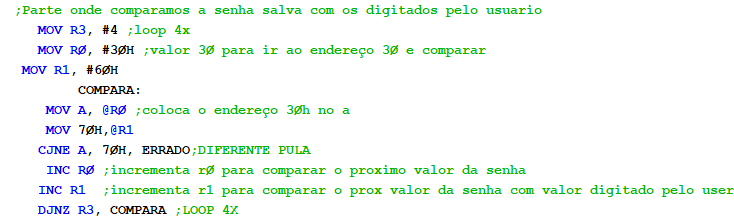
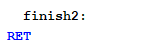
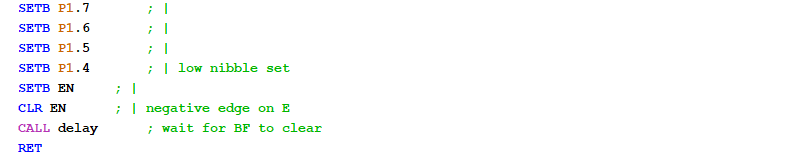

# Projeto de cadeado digital em Assembly

## Introdução: 
O projeto, desenvolvido em Assembly com execução no EdSim51DI, consiste em um cadeado digital, que, a princípio está bloqueado, aparecendo “_ _ _ _ Bloqueado“ no display LCD. Então, o usuário deve acertar a senha de fábrica, que tem 4 dígitos, a digitando no KeyPad para desbloquear o cadeado. Caso o usuário erre a senha e pressione  “#”  no KeyPad para enviá-la, aparece uma mensagem de “XXXX senha incorreta”.

Ao passo que o usuário digita a senha correta e a envia, o motor do EdSim51DI gira no sentido anti-horário, simbolizando a abertura do cadeado, e aparece no display LCD um menu com duas opções: “1” corresponde à mudança da senha para outra que contenha 4 dígitos, e “2” para sair do programa. Caso a opção escolhida seja “2”, o motor gira o sentido horário, simbolizando o trancamento do cadeado. Assim que o motor para de girar, aparece um “tchau =)”, todavia, se o usuário clicar em “1” no Keypad, aparece no display LCD um espaço para ele digitar a “nova senha” de 4 dígitos e, somente após enviá-la, essa nova senha sobrescreve a senha de fábrica no espaço de memória do EdSim51DI, em seguida, aparece uma mensagem de “senha salva”, após isso, o menu é exibido novamente, até que a pessoa escolha “sair”.

## Desenvolvimento:
**Aqui está uma explicação sobre a organização do código e o que cada parte dele é responsável por fazer.**

Nesse trecho inicial do código ocorre a definição de nomes simbólicos para pinos específicos, e informa onde é o início do código do programa.

Nesta parte, inserimos os valores que estão após o “#” nos endereços da memória de dados do EdSim51DI especificados antes do “H”. Assim, dos endereços 30h ao 33h estarão os valores “1111”, que correspondem a senha considerada “de fábrica”, ou seja, é essa senha que o usuário deve digitar para desbloquear o cadeado. 

Já nos endereços do 40H ao 4BH foram inseridos os valores do KeyPad, que serão utilizados para comparar com o que o usuário digitou e validar o que ele pressionou no teclado.

Aqui criamos “labels” referentes a todos os textos que desejamos escrever no display LCD durante o projeto.

### função MAIN: **É onde realizamos todo o projeto do cadeado de fato, toda a parte de interação como usuário e comparação do que ele digitou com o que está guardado na memória é feita aqui.**

Assim que o código entra nessa função, seu começo é responsável por organizar o que acontece:

-Em primeiro lugar chama a função lcd_init para inicializar o display LCD, tornando possível a escrita nele;  
-Chama a função TELA_INICIAL para escrever no display LCD a primeira tela do projeto;  
-Adiciona no contador A o valor específico para que a escrita no display para que o texto fique centralizado;  
-Chama a função posicionaCursor para que, a senha digitada pelo usuário ocupe a posição guardada no registrador A, afinal o posicionaCursor utiliza esse acumulador. Dessa forma, o número digitado aparecerá no lugar dos “_ _ _ _” no display LCD;

**Essa parte do código serve para escrever a senha digitada pelo usuário na memória, a partir do endereço 60H, escrevendo apenas 4 valores na memória e no display**

-Coloco o endereço 60h no registrador R1, pois esse é onde começamos a guardar a senha digitada pelo usuário antes dele apertar o enter (#);  
-Movemos 4 para o registrador 3, essa linha de código funciona como um loop de 4 repetições para que peguemos todos os 4 valores digitados pelo usuário;  

###  função ESPERA_VE_PRESSIONADO: é responsável por esperar até que o usuário clique em alguma tecla e guarde esse valor no registrador R0, também realiza contas para que o valor que aparece no display seja exatamente o que ele pressionou 

-Entra na função ESPERA_VE_PRESSIONADO  
-Chama a função leituraTeclado, para ler o que o usuário pressionou no KeyPad e armazenar no  endereço 60, afinal no display está a tela inicial, induzindo o usuário a digitar uma senha de 4 dígitos que deverá ser lida por essa linha; 
-JNB faz com que só saia desse “loop” da função ESPERA_VE_PRESSIONADO: até a linha do JNB quando o usuário clicar em alguma tecla; 
-(do “ESPERA_VE_PRESSIONADO: até o MOV A, @R0 fazemos a movimentação de valores para guardar o valor referente a tecla que o usuário clicou. Inicialmente, o valor que a pessoa clicou está em R0 então passamos desse registrador para A e de A para esse registrador, para que, no final, o acumulador tenha o valor que precisamos para prosseguir); 
-(no trecho do MOV R7, A até  MOV A, R7, prosseguimos o código realizando contas para que, ao final desse trecho, o acumulador contenha exatamente o valor que a pessoa clicou no teclado);
-Chamamos a função sendCharacter para que ela envie ao display o valor que a pessoa digitou no teclado, calculado nas contas acima; 
-É importante limpar o F0 para não dar problema, afinal, nessa parte do código  ele está sendo usado para verificar se alguma tecla foi pressionada; 
-Por fim, utilizamos o DJNZ para fechar a lógica do loop mencionado acima, ele decrementa a quantidade de iterações, fazendo com que o bloco de código responsável por pegar o valor que o usuário digitou no teclado e fazer com que ele apareça no display ocorra para os 4 dígitos da senha; 

###  função  ESPERA_VE_PRESSIONADO_ENTER:  espera o usuário digitar # para somente prosseguir o código após essa tecla ser clicada

-Movemos o valor referente ao enter (#) para o R3;  
-Criamos a função ESPERA_VE_PRESSIONADO_ENTER: (até o DJNZ) para que o código fique esperando e só continue a executar as instruções após o usuário clicar no “#”;  
-Essa função, em primeiro lugar, limpa o acumulador A, afinal utilizaremos ele novamente;  
-chamamos leituraTeclado para ver se o usuário pressionou alguma tecla;  
-Assim como a função “ESPERA_VE_PRESSIONADO”, a função “ESPERA_VE_PRESSIONADO_ENTER”, desde seu nome até o JNB fica esperando o usuário digitar algo e só vai para o código abaixo do da linha que está o JNB quando a pessoa clicar em alguma tecla;  
-No trecho de MOV A, #40H até MOV A, @R0 ocorre a mesma movimentação de valores que mencionei na descrição da função ESPERA_VE_PRESSIONADO, fazendo com que, no final o valor pressionado esteja no A;
-Limpamos o F0;  
-Comparamos para ver se a tecla pressionada pelo usuário é a tecla referente ao #, se não for, a Instrução CJNE faz  com que volte a função ESPERA_VE_PRESSIONADO_ENTER, só saindo dela e prosseguindo o código quando usuário clicar no #;  

Ao passo que o usuário clicou no #, ocorre a verificação da senha 

### Função COMPARA: é responsável por validar se a senha que ele digitou é a mesma senha que está guardada nos endereços a partir do 30H

-Movemos o valor 4 para o R3 para fazer um loop de 4 repetições;  
-Movemos para R0 o valor 30H pois é nesse endereço que está armazenada a senha padrão que desejamos comparar com o que o usuário digitou previamente;   
-Movemos para o R1 o valor 60H pois é a partir desse endereço que armazenamos os 4 dígitos da senha que o usuário pressionou no KeyPad;   
-Entra na função compara;   
-Movemos para o acumulador A  o endereço do valor guardado no R0;   
-Movemos para 70h o endereço do valor guardado no R1;   
-Usamos o CJNE para comparar os valores que estão no A (início da senha padrão) com os valores que estão no 70H, caso seja diferente ele vai para a função ERRADO;   
-Caso os valores sejam iguais o código incrementa R1;   
-E incrementa R0,para prosseguir verificando a senha;   
-Decrementa R3 e vai para a função compara para verificar os valores das senhas nos outros endereços de RO e R1;  

Caso toda a senha digitada pelo usuário esteja correta, fazemos o motor girar e entramos na função MENU:

### função MENU: é responsável mostrar ao usuário suas opções de ação e executar essas opções

-No seu início, ela chama a função tela menu para mostrar as opções de escolha do usuário no display LCD; 
-Movemos para o R3 o valor de #31H, que corresponde ao 1 do teclado; 
-Movemos para o R4 o valor de #32H, , que corresponde ao 2 do teclado (ambas são opcoes do menu); 

###  função ESPERA_VE_PRESSIONADO2: aguarda para ver qual número dentre o das duas opções o usuário escolheu, p levando para as respectivas execuções de código

-A primeira parte é igual ao ESPERA_VE_PRESSIONADO: 
-O CJNE compara o valor do 3h e A,caso eles sejam diferentes, ou seja, a pessoa clicou no 2, ela é levada para a função COMPARANDO2: 
-No acumulador A está o que a pessoa digitou e no 03H (que é o mesmo que R3) esta o numero 1),caso os valores sejam iguais, ou seja, se a pessoa clicou em 1 no teclado ele chama a função de TELA_MUDARSENHA; 
-Limpa o F0 pois voltaremos a precisar verificar qual tecla será pressionada; 
-Movemos para A a posição que desejamos começar a escrever no display LCD; 
-Chamamos a função para posicionar o cursor no local determinado acima; 
-Movemos o 50h para o A pois é apartir desse endereço que guardaremos a senha digitada pelo usuário até que ele clique no enter (#); 
-Movemos 4 para o R2 para servir como um loop pagar e guardarmos os 4 valores pressionados pelo usuário nos endereços descritos acima; 
-Entramos na função ESPERA_VE_PRESSIONADO_MENU1: que é responsável por esperar o usuário digitar os 4 dígitos da nova senha e salvá-los nos endereços a partir do endereço 50h; 
-Essa função inteira é a mesma lógica do ESPERA_VE_PRESSIONADO, só muda o registrador que armazenamos e o endereço de memória onde salvamos a senha digitada; 

Após o usuário digitar a nova senha, a função ESPERA_VE_PRESSIONADO_ENTER2 é a mesma lógica da função ESPERA_VE_PRESSIONADO_ENTER. 

**Após a pessoa ter clicado no enter, a senha que ela digitou e que foi guardada nos endereços a partir do endereço 50h serão passadas para os endereços a partir do endereço 30h, sobrescrevendo a senha de fábrica.

-Limpamos o acumulador A pois  usaremos; 
-Movemos para R0 o valor 30h pois é a partir desse endereço que escreveremos a nova senha; 
-Movemos o R1 o valor 50h pois é a partir desse endereço que a nova senha foi escrita; 
-Movemos para o R5 o 4 pois faremos 4 iterações entre os endereços descritos acima para mudar a senha de lugar; 

**A função MUDAR_SENHA_DE_ENDEREÇO  faz com que os valores guardados  partir do endereço 50h sejam escritos nos endereços a partir do endereço 30h, onde a senha antiga se encontra

-Para isso movemos para a o que está no endereço do R1; 
-Passamos para o endereço de R0 o que esta no A; 
-Incrementamos R0; 
-Incrementamos R1 para fazer essa sobrescrita de senha em para todos os 4 endereços; 
-Decrementamos R5 para continuarmos realizando a função 4 vezes voltamos para a função; 
-Após passarmos o endereço de lugar chamamos a função para mostrar no display a mensagem de senha salva; 
-Voltamos para o menu para continuarmos; 
-JMP main:loop; 

### A função ERRADO:

-Chama a função de tela responsável por fazer aparecer a mensagem de erro no display; 
-Move 2h para R5 para teste, ver se a função erro funciona mesmo 
-Quando acaba, retorna para a função MAIN; 

### função COMPARANDO2: é responsável pelo que ocorre quando o usuário clica na opção 2 do menu, nela, primeiro fazemos o motor girar no sentido horário

-Chamamos a função clearDisplay para limpar o display;
-Movemos 03h para o A, pois é nessa posição que desejamos escrever a próxima mensagem;
-Entramos na função EsperaRotacaoAnti: que é responsável por esperar que o motor gire voltas completas e, após isso, pará-lo;
-Chamamos a função posiconaCursor para começar a escrever na posição determinada acima;
-Chamamos a string que será escrita (tchau);
-Chamamos a função responsável por escrever a escrita predeterminada;
-Chamamos a função de delay para retardar esse processo;
-Chamamos a função de limpar o display;
-Limpamos F0 para não voltarmos para o código acima;

**No final do código tem todas as funções que chamamos durante o projeto. As primeiras funções são relacionadas as telas do display, ou seja, chamamos elas quando desejamos escrever no display após algo acontecer.**

### função TELA_SENHASALVA: 

-Chama a função responsável por limpar o display, ou seja, apagar tudo que está escrito nele;  
-Posiciona o cursor no lugar onde desejamos escrever a label que chamaremos;  
-Chama a função responsável por posicionar o cursor na posição desejada, mencionada acima;  
-Move a label #SENHASALVA para o registrador DPTR para escrevê-la no display;  
-Chama a função responsável por escrever a string da label #SENHASALVA;  
-Limpa o display e retornamos;  

### funções de tela “TELA_MUDARSENHA”, “TELA_INICIAL”, “TELA_ERRO”: 

seguem a mesma lógica da função “TELA_SENHASALVA”, só muda a quantidade de texto que desejamos escrever no display

### função TELA_MENU: **tem a mesma lógica que as demais telas, porém nela há um código responsável por esperar para saber se o motor já fez uma rotação completa no sentido anti-horário, rotação essa que ocorre quando a pessoa acerta a senha, antes de aparecer o menu no display LCD.**

Após limpar o display, o código verifica se houve uma rotação completa para, somente após isso, aparecer o menu no display. O código que verifica a rotação também é responsável por finalizá-la caso ela já tenha sido realizada em uma volta.

### função leituraTeclado: **é responsável por fazer uma varredura matricial, ela escaneia as linhas do KeyPad para identificar qual tecla foi pressionada.**

### função finish: e finish2: **são somente um retorno**

 

### função colScan: faz a varredura das colunas de um teclado matricial para detectar se alguma tecla foi pressionada.

### função escreveStringROM: escreve no display, a partir da posição alocada em A nas funções de tela, o texto desejado, letra por letra. 

### função lcd_init: é responsável por inicializar o display LCD. Ela é necessária para que possamos escrever no display LCD 

### função sendCharacter: envia um caractere de 8 bits para um display LCD, ela é necessária para enviar cada um dos caracteres das palavras que desejamos escrever no display 

### função clearDisplay: é responsável por limpar o display LCD por completo, ou seja, limpar todas as portas que ele usa.

### função delay: é responsável por atrasar a execução, ela faz isso ao criar um loop com 50 iterações 

## Funcionamento:
Para que o código dos commits funcione, é preciso utilizar o simulador de microcontrolador  8051 EdSim51DI (link para download fornecido na secção de referências).  
Após colar o código dos commits no EdSim51DI, configure o “Update Freq.” para 100 (como mostra a imagem 1), com essa frequência, o código roda em uma velocidade agradável.  
Ademais, dentro do EdSim51DI, utilizamos as ferramentas: Display LCD (imagem 2), motor (imagem 3) e KeyPad (imagem 4).  

   Imagem 1. 

   Imagem 2. 

 Imagem 3.  
 Imagem 4. 

## Referências:

-Download do EdSim51DI: https://edsim51.com/  
-Materiais de referência para o projeto foram fornecidos durante as aulas de arquitetura de computadores no Centro Universitário FEI.  

## Conclusão:

Em síntese, desenvolver o projeto no EdSim51DI e utilizar ferramentas como: keyPad, para captar a opção que o usuário escolheu do menu, bem como a senha de fábrica e a nova senha; Display LCD, para mostra-lo suas opções e resultado de suas ações, como senha correta/incorreta e senha salva; e o motor, para simular a abertura e o fechamento do cadeado, foi muito agregador e interessante para trazer uma melhor experiência ao usuário. Fez com que conseguíssemos desenvolver melhor nossos conhecimentos em Assembly, assim como desenvolver nossa capacidade de organizar e documentar um código durante sua realização. 
O único desafio encontrado foi solucionar um problema que, no display LCD aparecia muito texto randômico. Isso acontecia devido ao fato de termos salvo muitos textos ao ponto deles ocuparem o espaço em que a main está alocada.  

## Fluxograma:

## Simulação: [Assistir vídeo sobre o projeto](https://www.youtube.com/watch?v=8Y3Y5MJiHyA&t=4s)

